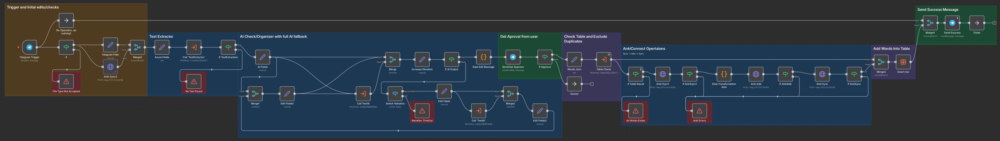
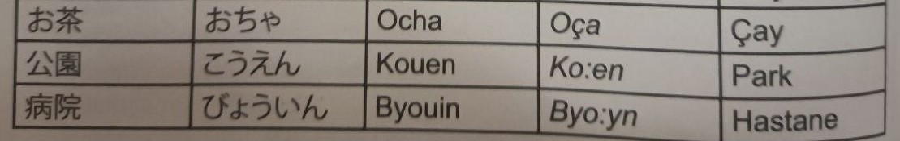
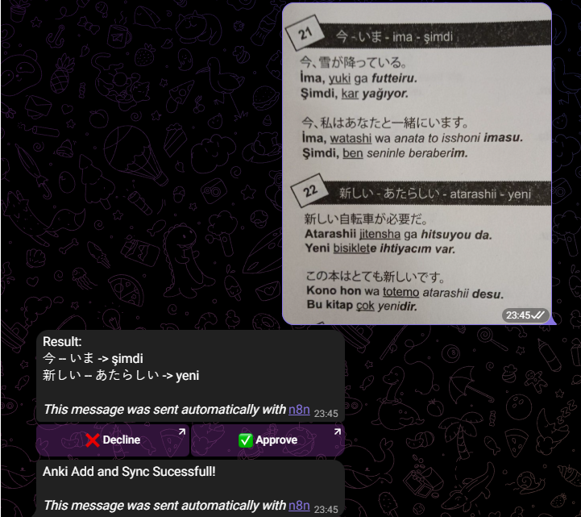

# ImageToAnki n8n Automation

An automated workflow system that extracts Japanese text from images sent via Telegram, processes it with AI, and automatically creates Anki flashcards.

## Overview

This project uses n8n workflows to automate the process of creating Japanese language flashcards from images. The system receives images via Telegram, extracts text using Azure Document Intelligence, validates and organizes the data with AI, and automatically adds new entries to Anki for language learning.

## Workflow Architecture

The automation consists of five main workflows:

### Visual Workflow Diagrams

You can view the interactive workflow diagrams at the following links:

- **[TextMain (Main Workflow)](https://share-n8n.net/shared/lTDqyv27tyHy)** - Primary orchestrator
- **[TextExtractor](https://share-n8n.net/shared/0iTsdCzweKyd)** - OCR text extraction
- **[TextAi](https://share-n8n.net/shared/KTkVz2jW9u0d)** - AI processing and validation
- **[TextTableCheck](https://share-n8n.net/shared/1er2YMryBw1T)** - Deduplication workflow
- **[Error Handler](https://share-n8n.net/shared/Uo9Q7QEmEXLH)** - Error notification system

---

### 1. **TextMain** (Main Workflow)
**[View Workflow →](https://share-n8n.net/shared/lTDqyv27tyHy)**

The primary orchestrator that handles the entire process from image receipt to Anki card creation.

**Key Steps:**
- Receives images from Telegram bot
- Validates file type (images only)
- Orchestrates all sub-workflows
- Handles user approval flow
- Manages Anki card creation and synchronization
- Logs successful entries to n8n data table

### 2. **TextExtractor** (OCR Sub-Workflow)
**[View Workflow →](https://share-n8n.net/shared/0iTsdCzweKyd)**

Extracts text from images using Azure Document Intelligence.

**Process:**
- Receives image binary data from main workflow
- Posts image to Azure Document Intelligence API
- Polls for completion status (with 1-second wait intervals)
- Returns extracted text content

### 3. **TextAi** (AI Processing Sub-Workflow)
**[View Workflow →](https://share-n8n.net/shared/KTkVz2jW9u0d)**

Processes and validates extracted text using Google Gemini AI.

**Features:**
- Accepts content and system message inputs
- Uses Google Gemini 2.5 Flash Lite model
- Parses AI response (handles both markdown-wrapped and raw JSON)
- Returns structured data with Japanese entries (Kanji, Hiragana, Meaning)
- **Smart Gap Filling:** The AI can intelligently fill missing data (any of Kanji, Hiragana, or Meaning) up to 35% of the total entries. If more than 35% of data is missing, the AI will reject the input and return an error, ensuring data quality and preventing excessive guessing. This can be tuned inside the 'AiFields' -> 'System Message'

### 4. **TextTableCheck** (Deduplication Sub-Workflow)
**[View Workflow →](https://share-n8n.net/shared/1er2YMryBw1T)**

Prevents duplicate entries by checking against existing database records.

**Logic:**
- Fetches all existing entries from n8n data table
- Compares new entries against existing Kanji characters
- Returns only unique entries that don't exist in the database

### 5. **Error Handler**
**[View Workflow →](https://share-n8n.net/shared/Uo9Q7QEmEXLH)**

Captures and reports workflow errors via Telegram notifications.

**Information Sent:**
- Error message
- Workflow name
- Last executed node
- Execution ID

## Workflow Process Flow



### Process Steps:

```
1. User sends image via Telegram
   ↓
2. Validate file type (image only)
   ↓
3. Extract text with Azure Document Intelligence (TextExtractor)
   ↓
4. Process with AI to organize data (TextAi)
   ↓
5. If extraction fails → Run OCR text through AI → Retry with corrected data
   ↓
6. Format and send results to user via Telegram
   ↓
7. Wait for user approval
   ↓
8. Check against database for duplicates (TextTableCheck)
   ↓
9. Add new cards to Anki:
   - Sync with AnkiWeb
   - Add notes to "Automated" deck
   - Sync again
   ↓
10. Log entries to n8n data table
   ↓
11. Send success confirmation to user
```

## Prerequisites

### Required Services

1. **n8n** - Workflow automation platform
2. **Telegram Bot** - For receiving images and sending notifications
3. **Azure Document Intelligence** - For OCR text extraction
4. **Google Gemini API** - For AI text processing
5. **Anki with AnkiConnect** - For flashcard management

### Telegram Setup
- Create a bot via [@BotFather](https://t.me/botfather)
- Configure bot credentials in n8n
- Note your chat ID for notifications

### Azure Document Intelligence
- Create an Azure Document Intelligence resource
- Configure API endpoint and key in n8n

### Google Gemini API
- Obtain API key from Google AI Studio
- Configure credentials in n8n
- Model used: `gemini-2.5-flash-lite`

## Anki Setup

This automation requires Anki to be running with the AnkiConnect addon. I am running it on a ARM device that is headless. (Orange Pi 3B with Ubuntu Server 24)

### AnkiConnect Installation

1. Install the [AnkiConnect addon](https://ankiweb.net/shared/info/2055492159) in Anki
2. Ensure you're signed into AnkiWeb for synchronization

### Running Anki on Ubuntu Server (ARM, No GUI)

Due to the headless ARM environment, the standard Anki installation doesn't work. The solution is to use the Flatpak version:

```bash
# Install Flatpak if not already installed
sudo apt update
sudo apt install flatpak

# Add Flathub repository
flatpak remote-add --if-not-exists flathub https://flathub.org/repo/flathub.flatpakrepo

# Install Anki from Flathub
flatpak install flathub net.ankiweb.Anki

# Run Anki with vnc
flatpak run --env=QT_QPA_PLATFORM=vnc net.ankiweb.Anki

#Run Anki with no gui
flatpak run \
    --env=QT_QPA_PLATFORM=offscreen \
    --env=ANKICONNECT_WILDCARD_ORIGIN=1 \
    net.ankiweb.Anki
```

**Source:** [https://github.com/flathub/net.ankiweb.Anki](https://github.com/flathub/net.ankiweb.Anki)

### Anki Deck Structure

The automation creates cards in the **"Automated"** deck using the **"Automated"** model with the following fields:
- **Word** - Japanese Kanji
- **Transliteration** - Hiragana reading
- **Meaning** - English translation

### AnkiConnect Configuration

Because n8n is running inside a docker, AnkiConnect is listenin on all connections (0.0.0.0:defaultPort). Ensure:
- Anki is running when the workflow executes
- AnkiConnect is listening on the correct port
- Network permissions allow n8n to communicate with AnkiConnect

## Data Structure

### Expected AI Output Format

```json
{
   "output": {
   "status": true,
   "message": "Successful.",
   "entries": [
      {
         "Kanji": "洗う",
         "Hiragana": "あらう",
         "Meaning": "Yıkamak"
      },
      {
         "Kanji": "ある",
         "Hiragana": "ある",
         "Meaning": "Var Olmak"
      }
   ]}
}
```

### n8n Data Table Schema

The workflow maintains a data table with columns:
- **Kanji** - Japanese characters (used for deduplication)
- **Hiragana** - Phonetic reading
- **Meaning** - English translation

## Error Handling

- All errors are captured by the Error Handler workflow
- Notifications sent via Telegram include:
  - Error message
  - Failed workflow name
  - Last executed node
  - Execution ID for debugging
- Specific error conditions:
  - No text found in image
  - Iteration timeout (max retries exceeded)
  - Duplicate entries detected
  - Invalid file type

## Features

### Retry Mechanism
If initial text extraction fails or AI output is invalid, the workflow:
1. Processes OCR text through AI for correction
2. Re-runs the AI validation with corrected input
3. Tracks iteration count to prevent infinite loops

### Deduplication
Before adding cards to Anki:
- Checks existing entries in n8n data table
- Filters out duplicates based on Kanji field
- Only processes unique entries

### User Approval
- Formatted preview sent to user via Telegram
- Waits for explicit approval before adding to Anki
- Supports cancellation option

### Synchronization
- Pre-sync before adding cards
- Post-sync after cards are added
- Ensures AnkiWeb stays up to date

## Usage

1. Send an image containing Japanese text to your Telegram bot
2. Wait for the automation to process 
3. Review the extracted entries sent to Telegram
4. Approve or cancel the addition
5. Receive confirmation when cards are successfully added to Anki

### Example Input

Here's an example of the type of image you can send to the bot:



The system will extract the Japanese text, identify the Kanji, Hiragana readings, and meanings, then create Anki flashcards automatically.

Model only focues on these three parts. other information that is in the image are disgarded. This means other type of images where Kanji,Hiragana and Meaning can be found, should work.


### Example Conversation

Here's what the interaction with the Telegram bot looks like from the user's perspective:




## Configuration

### Workflow Settings
- **Execution Timeout:** 600 seconds (10 minutes)
- **Execution Order:** v1
- **Caller Policy:** Workflows from same owner
- **Error Workflow:** Error Handler

### API Endpoints
- **Azure OCR:** Custom endpoint + model path
- **AnkiConnect:** `http://localhost:8765` (default)
- **Telegram:** Standard Telegram Bot API

## Troubleshooting

## License

This project is provided as-is for personal use.

## Acknowledgments

- [n8n](https://n8n.io/) - Workflow automation platform
- [Azure Document Intelligence](https://azure.microsoft.com/en-us/products/ai-services/ai-document-intelligence) - OCR service
- [Google Gemini](https://ai.google.dev/) - AI model
- [AnkiConnect](https://foosoft.net/projects/anki-connect/) - Anki API addon
- [Flathub Anki](https://github.com/flathub/net.ankiweb.Anki) - ARM-compatible Anki distribution
